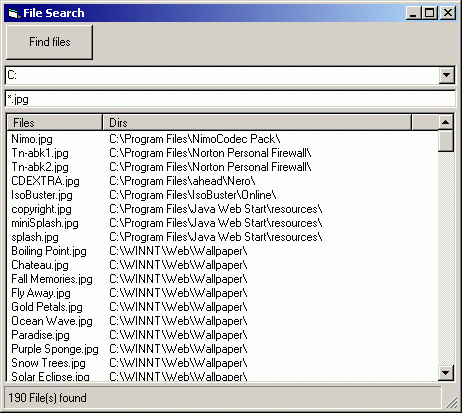



## Quick & Easy File Search

### Description

This is second upload of this app, after I fixed some bugs...

This program is searching for a specified file, you can use all the wild card combinations I personaly know of like * ? and just regular file names, from what I've seen its also does this pretty quickly. Hope you all like it :).
 
### More Info
 

             |
---                |---
**Submitted On**   |2003-01-31 15:08:56
**By**             |[Arthur Liberman](https://github.com/Planet-Source-Code/PSCIndex/blob/master/ByAuthor/arthur-liberman.md)
**Level**          |Intermediate
**User Rating**    |5.0 (15 globes from 3 users)
**Compatibility**  |VB 6\.0
**Category**       |[Files/ File Controls/ Input/ Output](https://github.com/Planet-Source-Code/PSCIndex/blob/master/ByCategory/files-file-controls-input-output__1-3.md)
**World**          |[Visual Basic](https://github.com/Planet-Source-Code/PSCIndex/blob/master/ByWorld/visual-basic.md)
**Archive File**   |[Quick\_&\_Ea1537201312003\.zip](https://github.com/Planet-Source-Code/arthur-liberman-quick-easy-file-search__1-42791/archive/master.zip)

